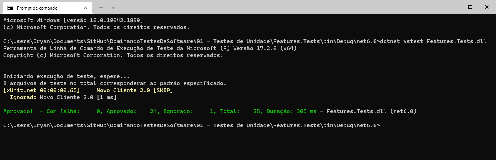

# Dominando Testes de Software | .NET 6

Projeto de estudos.

## Execução de testes via CLI

- Instalar pacote `xunit.runner.console`
- Após, realizar publish da aplicação (build)
- Na pasta do publish, abrir o terminal e executar o comando:

```cmd
dotnet vstest NomeProjeto.Tests.dll
```
<h1 align="center"> 
	
</h1>