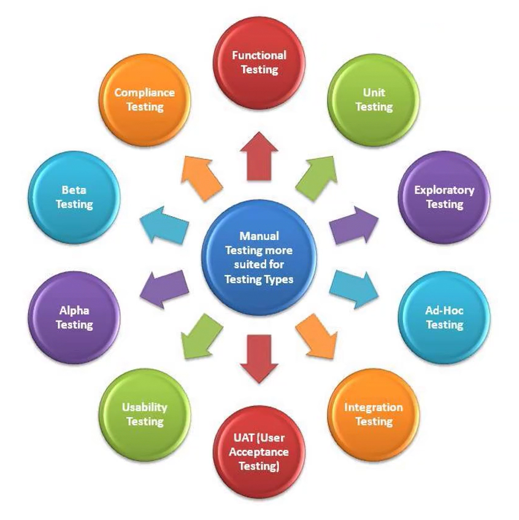
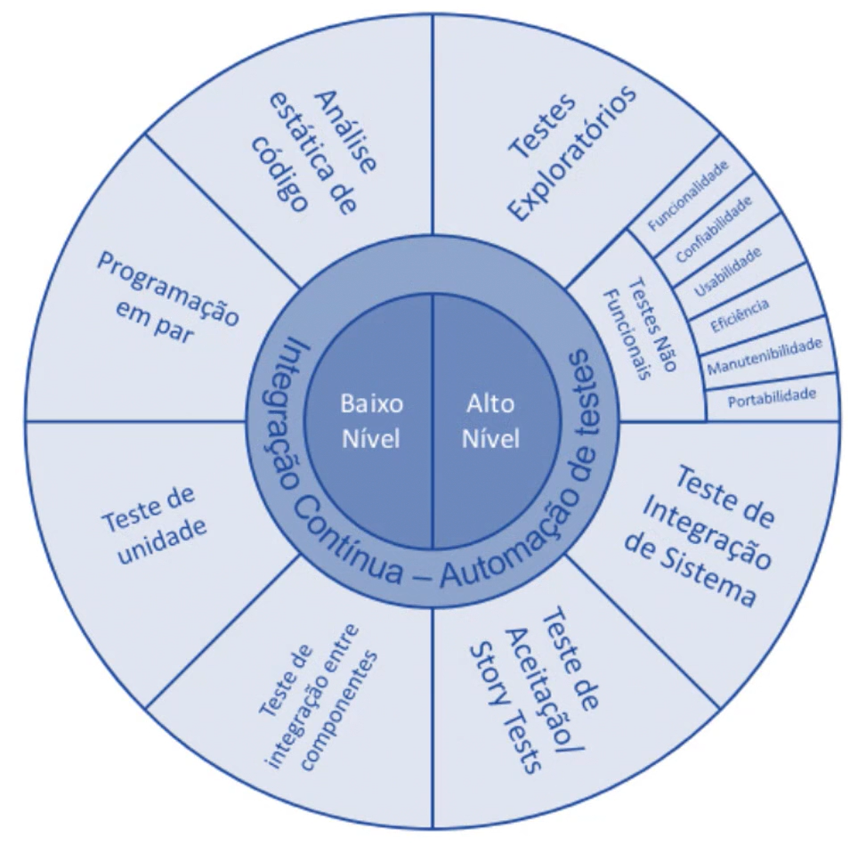
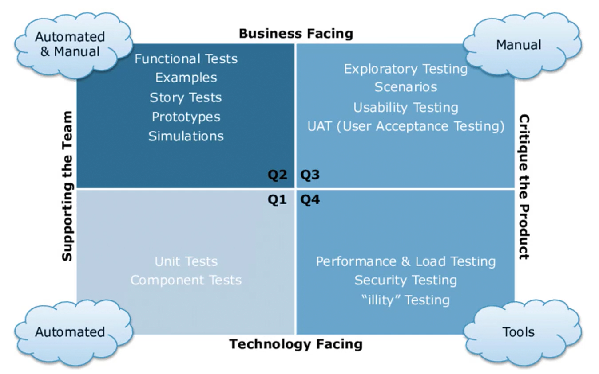
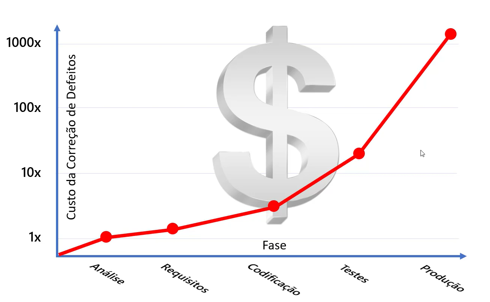

# Testes de Software

## Navegação

- [1. Consequências de não testar](#1-consequências-de-não-testar)
- [2. Como garantir a qualidade?](#2-como-garantir-a-qualidade)
- [3. Como testar?](#3-como-testar)
   - [3.1. Testes de Caixa-Preta | _Interface-Level_](#31-testes-de-caixa-preta--interface-level)
   - [3.2. Testes de Caixa-Branca | _Code-Level_](#32-testes-de-caixa-branca--code-level)
   - [3.3. Tipos de Testes Manuais](#33-tipos-de-testes-manuais)
   - [3.4. Testes de Integração Contínua - Automação de Testes](#34-testes-de-integração-contínua---automação-de-testes)
      - [3.4.1. Testes de Baixo Nível](#341-testes-de-baixo-nível)
      - [3.4.2. Testes de Alto Nível](#342-testes-de-alto-nível)
   - [3.5. Quandrante Mágico do Teste Ágil](#35-quandrante-mágico-do-teste-ágil)
   - [3.5.1. Q1](#351-q1)
   - [3.5.2. Q2](#352-q2)
   - [3.5.3. Q3](#353-q3)
   - [3.5.4. Q4](#354-q4)
- [4. Regra 10 de Myers](#4-regra-10-de-myers)
- [5. Tipos de Testes Mais Comuns](#5-tipos-de-testes-mais-comuns)
   - [5.1 Testes de Unidade](#51-testes-de-unidade)
   - [5.2 Testes de Integração](#52-testes-de-integração)
   - [5.3 Testes Automatizados](#53-testes-automatizados)
   - [5.4 Testes de Carga](#54-testes-de-carga)
- [6. Frameworks para Testes de Unidade | .NET](#6-frameworks-para-testes-de-unidade--net)
   - [6.1 MSTest](#61-mstest)
   - [6.2 UNit](#62-unit)
   - [6.3 XUnit](#63-xunit)
- [7. Padrões e Nomenclaturas](#7-padrões-e-nomenclaturas)
   [7.1 Nomenclatura de Testes de Unidade](#71-nomenclatura-de-testes-de-unidade)
- [8. Mock](#8-mock)
   - [8.1. O que é um Mock?](#81-o-que-é-um-mock)
   - [8.2. Framework Moq](#82-framework-moq)
      - [8.2.1. Instalação](#821-instalação)

---

## 1. Consequências de não testar

- Muitos bugs e problemas de qualidade
- Falhas de codificação
- Possíveis atrasos na entrega
- Perda de confiança do cliente
- Desmotivação do time
- Aumento na rotatividade de pessoas
- Prejuízos financeiros
- Possíveis implicações legais (multa)

---

## 2. Como garantir a qualidade?

A certificação por terceiros é uma solução, envolve três fatores principais:

- Normas
   - ISO
      - ISO/IEC 9126 - NBR 13596
- Orgãos
   - Inmetro
   - SEI (Software Engineering Institute)
      - CMMI (Capability Maturity Model® Integration)
- Organismos
   - Sistemas de Gestão em Tecnologia da Informação - OTI
   - Sistemas de Gestão Ambiental - OCA

---

## 3. Como testar?

Testes de Caixa-Preta e Caixa-Branca.

### 3.1. Testes de Caixa-Preta | _Interface-Level_

Nível de interface da aplicação, que simulam a usabilidade por um usuário da aplicação.

- Testes Funcinais
- Testes de Regressão
- Testes de UI

### 3.2. Testes de Caixa-Branca | _Code-Level_

Ligado ao código-fonte, feito por testadores (com capacidade de entender código-fonte) ou desenvolvedores.

- Debug
- Testes de Unidade
- Testes de Integração
- Testes de Carga

### 3.3. Tipos de Testes Manuais

- Teste Funcional - _Functional Testing_
- Teste de Unidade - _Unit Testing_
- Teste Exploratório - _Exploraty Testing_
- Teste Ad-Hoc - _Ad-Hoc Testing_
- Teste de Integração - _Integration Testing_
- Teste de Aceitação do Usuário - _UAT (User Acceptance Testing)_
- Teste de Usabilidade - _Usability Testing_
- Teste Alfa - _Alpha Testing_
- Teste Beta - _Beta Testing_
- Teste de Conformidade - _Compliance Testing_

<h1 align="center"> 
	
</h1>

### 3.4. Testes de Integração Contínua - Automação de Testes

Divididos em testes de baixo e alto nível.

#### 3.4.1. Testes de Baixo Nível

Está mais para Caixa-Branca.

- Análise estática de código
- Programação em par
- Teste de Unidade
- Teste de Integração entre componentes

#### 3.4.2. Testes de Alto Nível

Está mais para Caixa-Preta.

- Testes Exploratórios
- Testes Não Funcionais
    - Funcionalidade
    - Confiabilidade
    - Usabilidade
    - Eficiência
    - Manutebilidade
    - Portabilidade
- Teste de integração de Sistema
- Teste de Aceitação / Story Tests

<h1 align="center"> 
	
</h1>


### 3.5. Quandrante Mágico do Teste Ágil

#### 3.5.1. Q1

Testes automatizados, faz face com a tecnologia e suporta o time de desenvolvimento.

- Testes de Unidade - _Unit Tests_
- Testes de Componentes - _Component Tests_

#### 3.5.2. Q2

Testes automatizados e/ou manuais, faz face com o negócio e suporta o time de desenvolvimento.

- Testes Funcionais - _Functional Tests_
- Testes de História - _Story Tests_
- Protótipos - _Prototypes_
- Simulações - _Simulations_

### 3.5.3. Q3

Testes manuais, faz face com o negócio em busca de crítica/mal funcinamento do produto.

- Testes Exploratórios - _Exploratory Testing_
- Cenários - _Scenarios_
- Testes de Usabilidade - _Usability Testing_
- Testes de Aceitação do Usuário - _UAT (User Acceptance Testing)_

### 3.5.4. Q4

Testes realizados atráves de ferramentas, faz face com a tecnologia em busca de crítica/mal funcinamento do produto.

- Testes de Performance e Carga - _Performance & Load Testing_
- Testes de Segurança - _Security Testing_
- Testes de '*ilidade' (Estabilidade, Confiabilidade, Escalabilidade, Manutenção, Compatibilidade, etc) - _illity Testing_

<h1 align="center"> 
	
</h1>

---

## 4. Regra 10 de Myers

Criada por Glenford Myers, estabelece que o custo da correção de defeitos é mais custoso quanto mais tarde o defeito é encontrado.

Corrigir um defeito encontrado em ambiente Produção (PRD) custa muitos mais caro do que se fosse encontrado na fase de análise ou desenvolvimento.

<h1 align="center"> 
	
</h1>

---

## 5. Tipos de Testes Mais Comuns

Testes que desenvolvedores precisam fazer para garantir a qualidade do seu código.

- Testes de Unidade
- Testes de Integração
- Testes Automatizados
- Testes de Carga

### 5.1 Testes de Unidade

_Obs.: Termo correto é "**Teste de Unidade**" e não "**Teste Unitário**"_

Testa uma única unidade do sistema, de maneira isolada, geralmente simulando as prováveis dependências que aquela unidade tem.

Em linguagens de paradigma da POO (Programação Orientada à Objetos), é comum que a unidade seja uma classe.

Exemplo, quando precisa-se escrever testes de unidade para uma classe "Produto", os testes irão testar o funcionamento dessa classe de maneira isolada e sem interações com outras classes, não testando a classe inteira de uma vez, e sim testando cada método dessa classe, criando quantos testes forem necessários para testar aquele método, e ao final toda a classe acaba sendo testada.

### 5.2 Testes de Integração

Testa a integração entre duas ou mais partes da aplicação.

Esses testes garantem que as unidades da aplicação estão se integrando conforme o esperado, algo que os testes de unidade não garantem.

Exemplo, os testes da classe ProdutoService e ProdutoRepository onde o teste vai até o banco de dados, é um teste de integração.

### 5.3 Testes Automatizados

É um teste de sistema, podendo ser considerado como um teste de aceitação, funciona como um teste de caixa-preta, já que o sistema é testado de ponta a ponta através das operações executadas no sistema.

A automatização garante que todo o processo será executado da mesma maneira que fosse um usuário utilizando a apliação.

Pode ser considerado como um teste de aceitação pois além de garantir o funcionamento ponta a ponta, pode-se validar características do negócio e funcionalidades.

Também pode ser considerado como um teste de regressão, pois sua execução garante que a aplicação não regrediu, ou seja, que não surgiram novos defeitos em componentes que já estavam funcionando nas versões anteriores.

### 5.4 Testes de Carga

Testa as capacidades da aplicação, muitas vezes até seu limite, de forma que a aplicação não consiga mais responder.

É um teste muito importante em aplicações Web e aplicações que é esperado um grande volume de requisições.

Pode ser considerado como um teste de stress.

Objetivos deste tipo de teste:
- Testar a performance do código e componentes em situações extremas, descobrir possíveis gargalos
- Testar como a aplicação irá se comportar com um determinado número de usuários simultâneos e garantir que irá atender a demanda
- Testar um possível balanceamento de carga no servidor ou até mesmo a escala elástica na nuvem

---

## 6. Frameworks para Testes de Unidade | .NET

- MSTest
- NUnit
- XUnit

### 6.1 MSTest

É open source e da Microsoft.

Link repositório: [https://github.com/microsoft/testfx](https://github.com/microsoft/testfx)


### 6.2 UNit

Portabilidade do JUnit, que é para Java.

Link site: [https://nunit.org](https://nunit.org)


### 6.3 XUnit

- Mais novo entre as opções
- Gratuito
- Open source
- Escrito pelos criadores originais do NUnit v2
- Compatível com Visual Studio
- Utilizado pelo time de desenvolvimento do .NET Core e ASP.NET

Link site: [https://xunit.net](https://xunit.net)<br>
Link repositório: [https://github.com/xunit/xunit](https://github.com/xunit/xunit)

#### 6.3.1 Instalação

Instalação do framework

```powershell
Install-Package xunit
```

Instalação para reconhecimento do Visual Studio
```powershell
Install-Package xunit.runner.visualstudio
```

---

## 7. Padrões e Nomenclaturas

### 7.1 Nomenclatura de Testes de Unidade

Padrão: ObjetoEmTeste_MetodoComportamentoEmTeste_ComportamentoEsperado.

Exemplos:

```
Pedido_AdicionarPedidoItem_DeveIncrementarUnidadesSeItemJaExistente

Estoque_RetirarItem_DeveEnviarEmailSeAbaixoDe10Unidades
```

Alternativa de padrão: MetodoEmTeste_EstadoEmTeste_ComportamentoEsperado.

Exemplos:
```
AdicionarPedidoItem_ItemExistenteCarrinho_DeveIncrementarUnidadesDoItem

RetirarItemEstoque_EstoqueAbaixoDe10Unidades_DeveEnviarEmailDeAviso
```

---

## 8. Mock

### 8.1. O que é um Mock?

Do inglês _Mock Object_, são objetos que simulam o comportamento de objetos reais de forma controlada.

São normalmente criados para testar o comportamento de outros objetos. Em outras palavras, os objetos mock são objetos "falsos" que simulam o comportamento de uma classe ou objeto "real" para que seja possível focar o teste na unidade a ser testada.

Uma vantagem do Mock é que o objeto simulado pode ser criado dinamicamente através de um framework de Mock, poupando o desenvolvedor de ter que criar uma classe física para simular aquele objeto.

Uma classe física que simula o objeto costuma ser chamada de Fake, mas na teoria é um Mock, a diferença é que foi criada manualmente.

### 8.2. Framework Moq

- Realizar Mock com facilidade
- Open source, gratuito
- Compatível com Visual Studio
- Utilizado pelo time de desenvolvimento do .NET Core e ASP.NET

Link do repositório: [https://github.com/moq/moq4](https://github.com/moq/moq4)

#### 8.2.1. Instalação

Instalação do framework

```powershell
Install-Package Moq
```